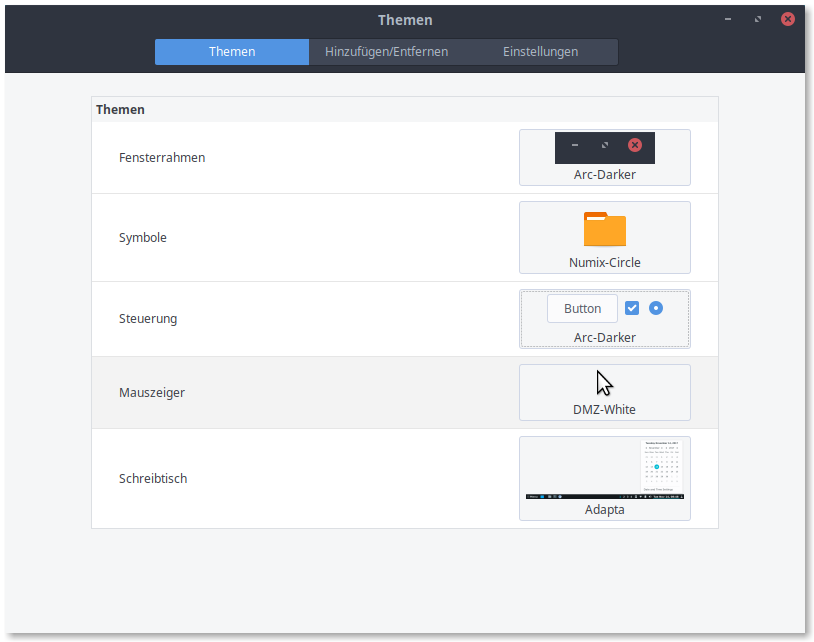

# linux-theme
Linux theme und configs die ich für Linux Mint benutze

```python
chmod u+x install_theme.sh
./install_theme.sh
```

* Themen -> Hinzufügen: "Adapter"



### Für konky:
Startprogramme -> +

BILD

* Name: conkyautostart
* Befehl: sh $HOME/Scripts/conkystart.sh
* Startverzögerung: 5
